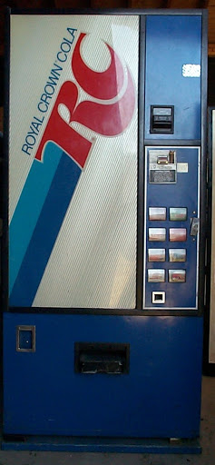

# IOT Beer Machine

This project ames to convert an old RC Cola machine into an internet controled beer machine.  
Where using your smart phone you can log into the beer machine app and then despense a
desired beer. The app will enforce permissions to decide if the beer should be dispensed.

# Equiptment

# Reading

## IOT Hub

- https://docs.microsoft.com/en-us/azure/iot-hub/iot-hub-devguide-device-twins
- https://docs.microsoft.com/en-us/azure/iot-hub/iot-hub-scaling
- https://docs.microsoft.com/en-us/rest/api/iothub/service/devicemethod/invokedevicemethod